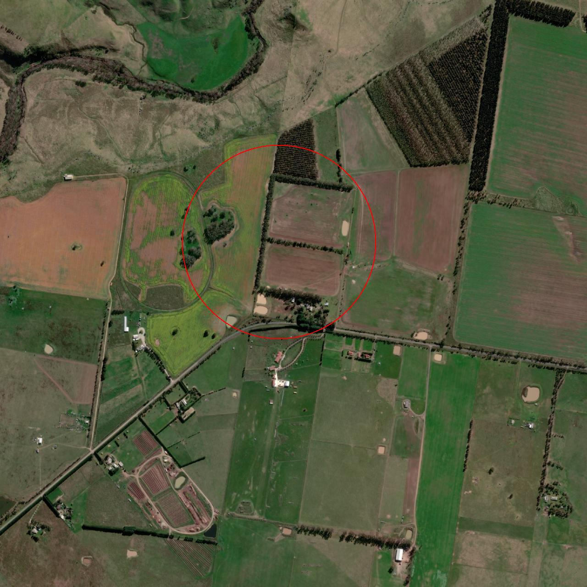
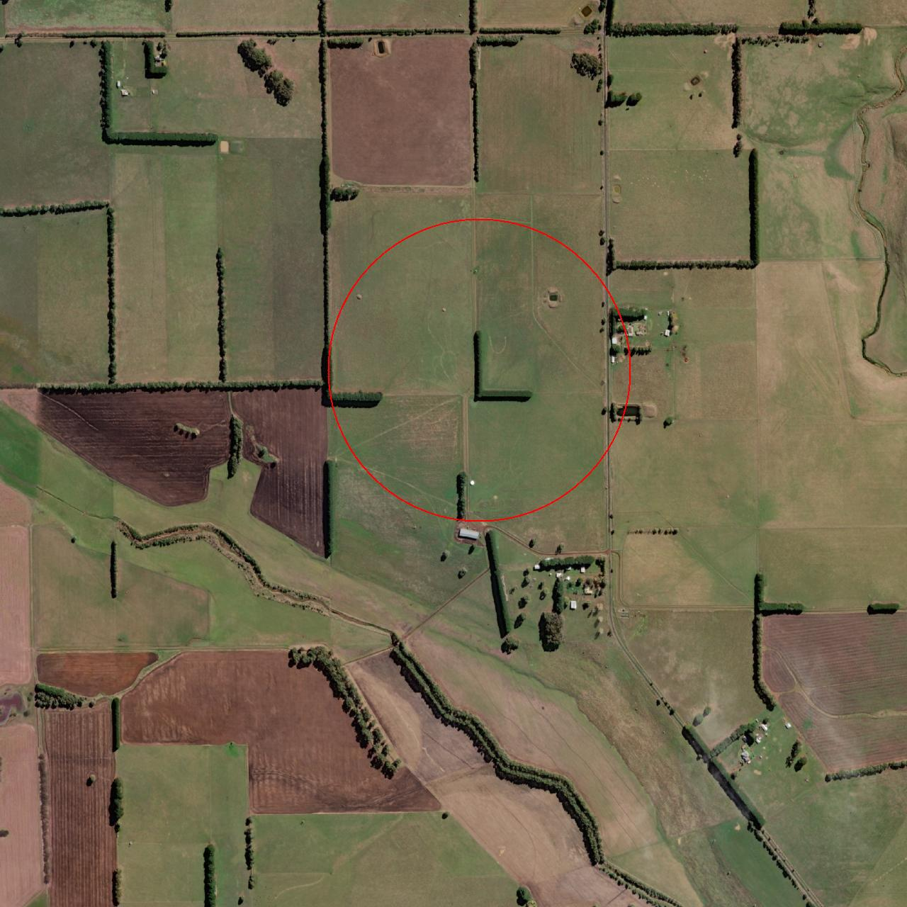
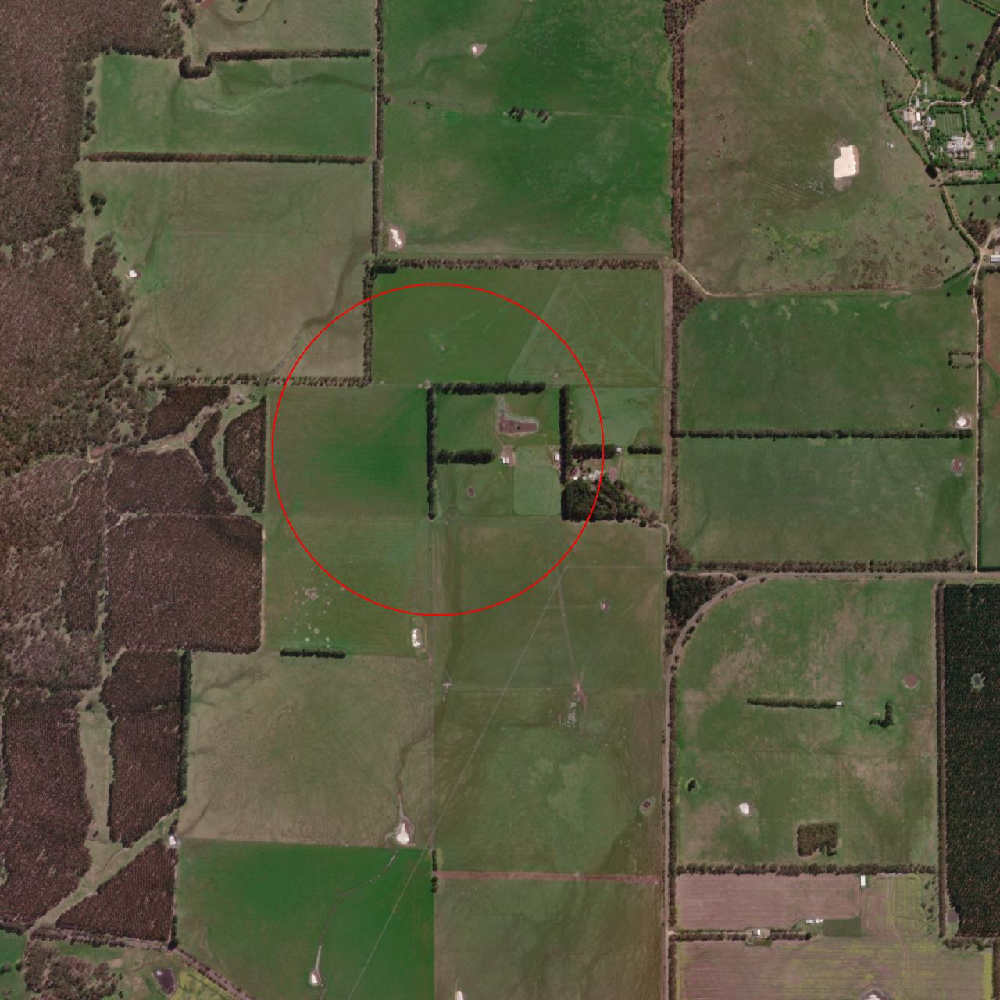
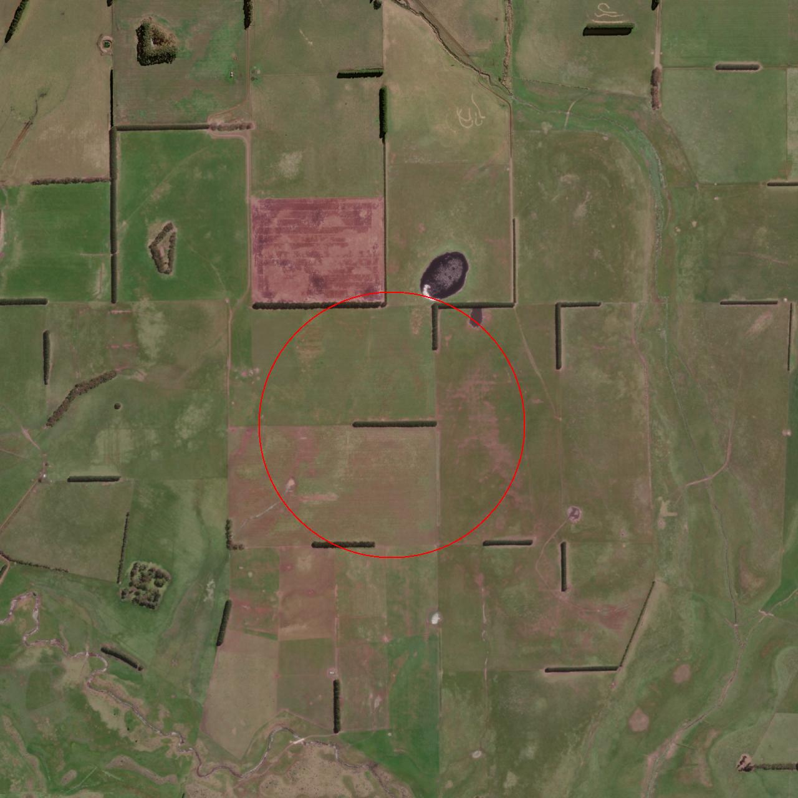
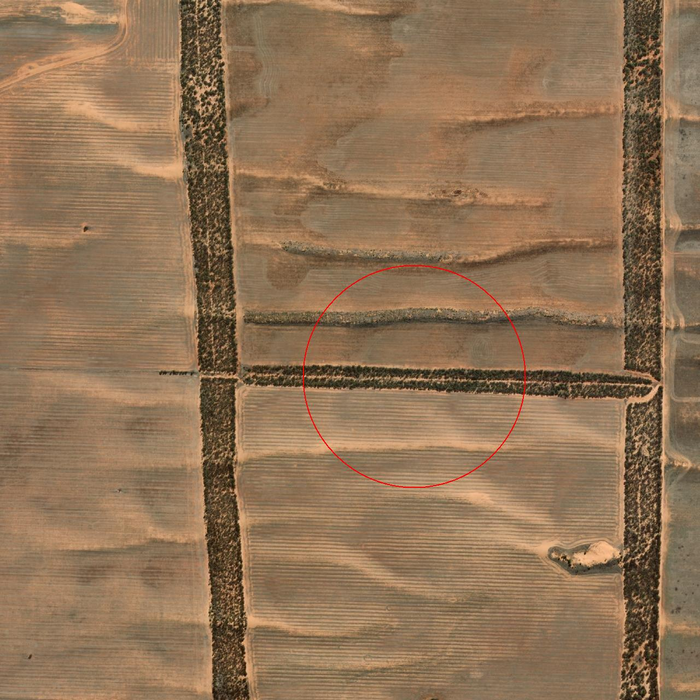
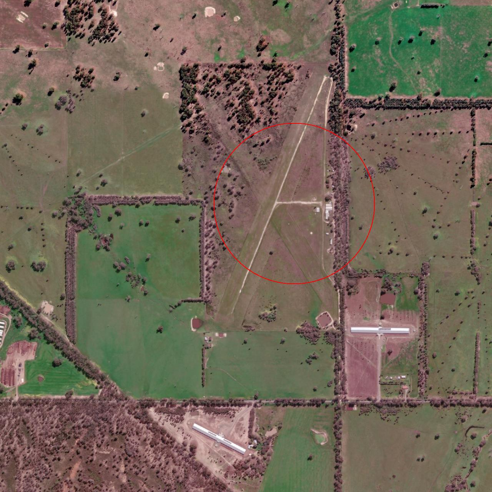
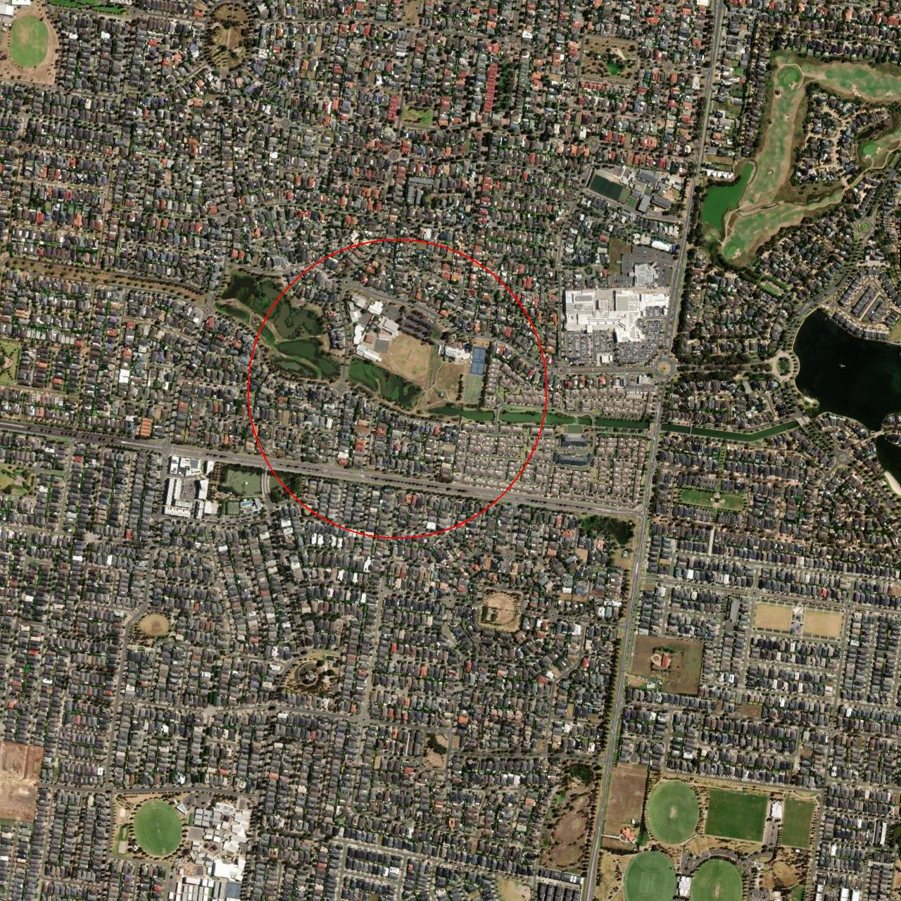
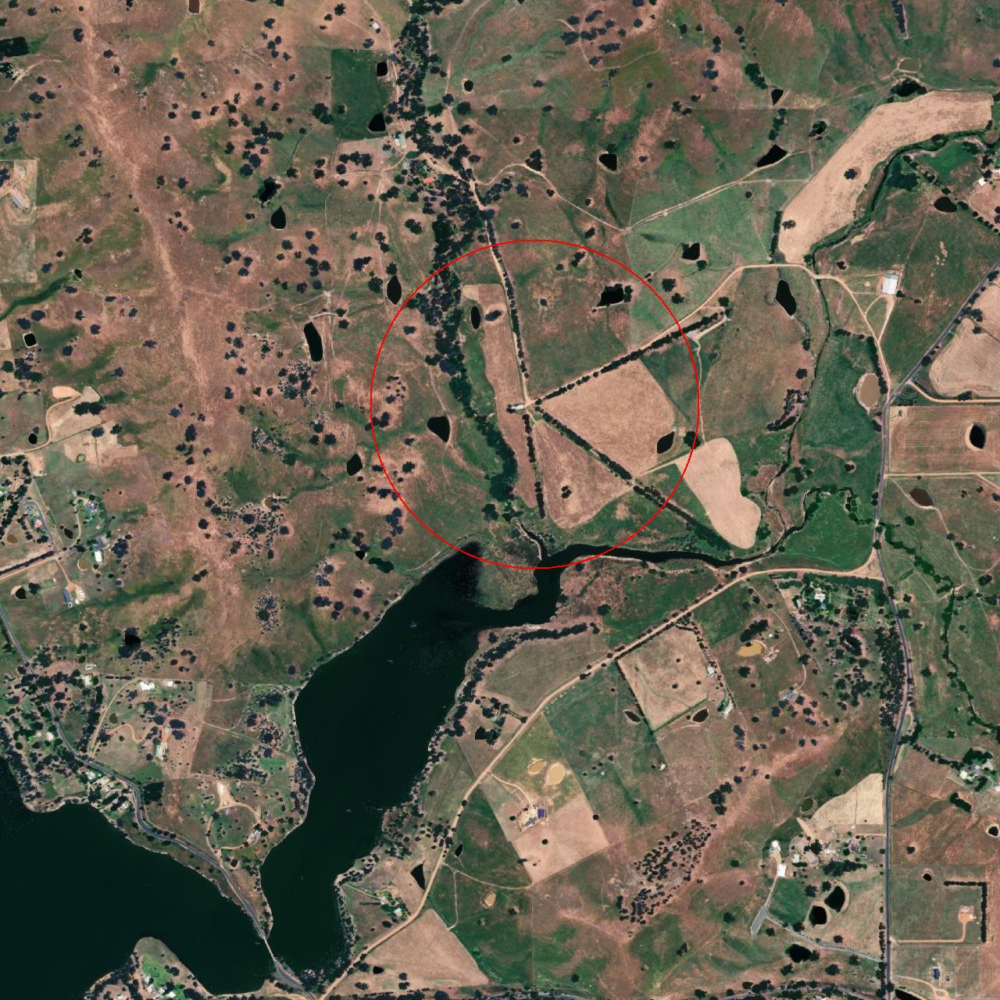

Click your Avatar's Snowball

Click 'Map'

Click the South-East Toilet Tunnel Network exit:

> 

Walk West toward the gate

Click the 'Drone Path' terminal:

> 
>
> ### Silver Medal

Click the hamburger menu in the top right -> 'Menu' -> 'FileShare':

> 

Download 'https://hhc24-dronepath.holidayhackchallenge.com/files/fritjolf-Path.kml'

Run the following PowerShell script to print the flightpath of 'fritjolf-Path.kml':

```powershell
function kml_to_ascii {
    param(
        [string]$kml_file
    )

    # Required console dimensions
    $requiredWidth = 150
    $requiredHeight = 30

    # Get current console dimensions
    $currentWidth = $Host.UI.RawUI.WindowSize.Width
    $currentHeight = $Host.UI.RawUI.WindowSize.Height

    # Check if console is large enough
    if ($currentWidth -lt $requiredWidth -or $currentHeight -lt $requiredHeight) {
        Write-Host "Error: Console window is too small." -ForegroundColor Red
        Write-Host "Current size: ${currentWidth}x${currentHeight}" -ForegroundColor Yellow
        Write-Host "Required size: ${requiredWidth}x${requiredHeight}" -ForegroundColor Yellow
        Write-Host "`nPlease resize your terminal window and try again." -ForegroundColor Yellow
        return
    }

    $width = $requiredWidth
    $height = $requiredHeight

    function Convert-ToAzimuthalEquidistant {
        param (
            [double]$lon,
            [double]$lat
        )
        $lonRad = $lon * [Math]::PI / 180
        $latRad = $lat * [Math]::PI / 180
        $rho = [Math]::PI/2 + $latRad
        
        return @{
            X = $rho * [Math]::Sin($lonRad)
            Y = -$rho * [Math]::Cos($lonRad)
        }
    }

    # Create empty canvas
    $canvas = New-Object 'char[,]' $height, $width
    for ($y = 0; $y -lt $height; $y++) {
        for ($x = 0; $x -lt $width; $x++) {
            $canvas[$y, $x] = ' '
        }
    }

    # Check if file exists
    if (-not (Test-Path $kml_file)) {
        Write-Host "Error: KML file not found: $kml_file" -ForegroundColor Red
        return
    }

    # Read and parse KML
    try {
        $kmlContent = Get-Content $kml_file -Raw
        $coordinates = [regex]::Match($kmlContent, '<coordinates>(.*?)</coordinates>', 'Singleline').Groups[1].Value.Trim()

        if ([string]::IsNullOrEmpty($coordinates)) {
            Write-Host "Error: No coordinates found in KML file" -ForegroundColor Red
            return
        }
    }
    catch {
        Write-Host "Error reading KML file: $_" -ForegroundColor Red
        return
    }

    # Convert coordinates
    $points = $coordinates -split ' ' | Where-Object { $_ -ne '' } | ForEach-Object {
        $coords = $_ -split ','
        $projected = Convert-ToAzimuthalEquidistant -lon $coords[0] -lat $coords[1]
        [PSCustomObject]@{
            X = $projected.X
            Y = $projected.Y
        }
    }

    # Find bounds
    $minX = ($points | Measure-Object -Property X -Minimum).Minimum
    $maxX = ($points | Measure-Object -Property X -Maximum).Maximum
    $minY = ($points | Measure-Object -Property Y -Minimum).Minimum
    $maxY = ($points | Measure-Object -Property Y -Maximum).Maximum

    # Calculate scale with zoom out
    $rangeX = $maxX - $minX
    $rangeY = $maxY - $minY
    $scale = [Math]::Min($width / $rangeX, ($height * 2) / $rangeY)

    # Center point
    $centerX = ($minX + $maxX) / 2
    $centerY = ($minY + $maxY) / 2

    # Draw connected path
    for ($i = 0; $i -lt $points.Count - 1; $i++) {
        $x1 = [Math]::Floor($width/2 + ($points[$i].X - $centerX) * $scale)
        $y1 = [Math]::Floor($height/2 + ($points[$i].Y - $centerY) * $scale/2)
        $x2 = [Math]::Floor($width/2 + ($points[$i+1].X - $centerX) * $scale)
        $y2 = [Math]::Floor($height/2 + ($points[$i+1].Y - $centerY) * $scale/2)
        
        # Draw line between points
        $steps = [Math]::Max([Math]::Abs($x2 - $x1), [Math]::Abs($y2 - $y1))
        if ($steps -eq 0) { $steps = 1 }
        
        for ($step = 0; $step -le $steps; $step++) {
            $x = [Math]::Floor($x1 + ($x2 - $x1) * $step / $steps)
            $y = [Math]::Floor($y1 + ($y2 - $y1) * $step / $steps)
            
            if ($x -ge 0 -and $x -lt $width -and $y -ge 0 -and $y -lt $height) {
                $canvas[$y, $x] = '.'
            }
        }
    }

    # Output the path
    Write-Host "`nDisplaying path from $kml_file `n" -ForegroundColor Cyan
    for ($y = 0; $y -lt $height; $y++) {
        $line = ""
        for ($x = 0; $x -lt $width; $x++) {
            $line += $canvas[$y, $x]
        }
        Write-Host $line
    }
}

kml_to_ascii "fritjolf-Path.kml"
```

> 
> 
> The unusual word followed by a number 1 at the end make this look like a password.
> The filename 'fritjolf-Path.kml' indicates a possible username 'fritjolf'
 
Click the hamburger menu in the top right -> 'Menu' -> 'Login'
Fill in the credentials we found, and click the 'Login' button

> 

Click the hamburger menu in the top right -> 'Menu' -> 'Profile'

> 

Download the file https://hhc24-dronepath.holidayhackchallenge.com/files/secret/Preparations-drone-name.csv

Run the following PowerShell script to download satellite images of each of the locations:

```powershell
# Required for image manipulation
Add-Type -AssemblyName System.Drawing

# Read the CSV file
$csvData = Import-Csv -Path "Preparations-drone-name.csv"

# Create output directory if it doesn't exist
$outputDir = Join-Path $PWD "map_squares"
if (-not (Test-Path $outputDir)) {
    New-Item -ItemType Directory -Path $outputDir -Force
}

# Parameters for the map
$zoom = 16          # Zoom level for detail
$width = 256        # Standard tile size
$height = 256       # Standard tile size
$radius = 400       # Circle radius in meters
$gridSize = 5       # Number of tiles in each direction (e.g., 5 means 5x5 grid)
$halfGrid = [Math]::Floor($gridSize / 2)  # Used for centering

function Get-TileNumber($lat, $lon, $zoom) {
    $n = [Math]::Pow(2, $zoom)
    $x = [Math]::Floor(($lon + 180.0) / 360.0 * $n)
    $y = [Math]::Floor((1.0 - [Math]::Log([Math]::Tan($lat * [Math]::PI / 180.0) + 1.0 / [Math]::Cos($lat * [Math]::PI / 180.0)) / [Math]::PI) / 2.0 * $n)
    return @($x, $y)
}

function Get-PixelCoordinate($lat, $lon, $centerTileX, $centerTileY, $zoom) {
    $n = [Math]::Pow(2, $zoom)
    
    # Calculate global pixel coordinates
    $globalX = (($lon + 180) / 360) * $n * $width
    $latRad = $lat * [Math]::PI / 180
    $globalY = (1 - ([Math]::Log([Math]::Tan($latRad) + 1 / [Math]::Cos($latRad))) / [Math]::PI) / 2 * $n * $height
    
    # Calculate the pixel coordinates relative to the center tile
    $centerTilePixelX = $centerTileX * $width
    $centerTilePixelY = $centerTileY * $height
    
    # Calculate local coordinates within our grid
    $localX = $globalX - ($centerTileX - $halfGrid) * $width
    $localY = $globalY - ($centerTileY - $halfGrid) * $height
    
    return @([int]$localX, [int]$localY)
}

function Get-MetersPerPixel($lat, $zoom) {
    return (156543.03392 * [Math]::Cos($lat * [Math]::PI / 180) / [Math]::Pow(2, $zoom))
}

# Process each coordinate
$index = 0
foreach ($point in $csvData) {
    try {
        # Convert coordinates to double and ensure they're valid
        $lat = [double]($point.'OSD.latitude' -replace '[^0-9.-]', '')
        $lon = [double]($point.'OSD.longitude' -replace '[^0-9.-]', '')
        
        Write-Host "Processing point $($index + 1) - Lat: $lat, Lon: $lon"
        
        # Get center tile coordinates
        $tileCoords = Get-TileNumber $lat $lon $zoom
        $centerX = $tileCoords[0]
        $centerY = $tileCoords[1]
        
        # Create a bitmap to store the combined image
        $combinedBitmap = New-Object System.Drawing.Bitmap -ArgumentList ($gridSize * $width), ($gridSize * $height)
        $graphics = [System.Drawing.Graphics]::FromImage($combinedBitmap)
        
        # Download and draw tiles
        for ($offsetY = -$halfGrid; $offsetY -lt ($gridSize - $halfGrid); $offsetY++) {
            for ($offsetX = -$halfGrid; $offsetX -lt ($gridSize - $halfGrid); $offsetX++) {
                $x = $centerX + $offsetX
                $y = $centerY + $offsetY
                
                $url = "https://server.arcgisonline.com/ArcGIS/rest/services/World_Imagery/MapServer/tile/$zoom/$y/$x"
                $tempFile = [System.IO.Path]::GetTempFileName()
                
                $headers = @{
                    "User-Agent" = "PowerShell/7.0 (Windows NT 10.0; Win64; x64) Custom/1.0"
                    "Referer" = "https://www.openstreetmap.org/"
                }
                
                try {
                    $ProgressPreference = 'SilentlyContinue'
                    Invoke-WebRequest -Uri $url -OutFile $tempFile -Headers $headers
                    
                    $tile = [System.Drawing.Image]::FromFile($tempFile)
                    $graphics.DrawImage($tile, 
                        ($offsetX + $halfGrid) * $width, 
                        ($offsetY + $halfGrid) * $height, 
                        $width, $height)
                    $tile.Dispose()
                    Remove-Item $tempFile -Force
                }
                catch {
                    Write-Host "Error downloading/processing tile: $_"
                }
                
                Start-Sleep -Milliseconds 500
            }
        }
        
        # Calculate pixel coordinates for the center point
        $pixelCoords = Get-PixelCoordinate $lat $lon $centerX $centerY $zoom
        $centerPixelX = $pixelCoords[0]
        $centerPixelY = $pixelCoords[1]
        
        # Create pen for circle (2 pixels wide, red)
        $pen = New-Object System.Drawing.Pen ([System.Drawing.Color]::Red), 2
        
        # Calculate circle radius in pixels
        $metersPerPixel = Get-MetersPerPixel $lat $zoom
        $radiusPixels = [int]($radius / $metersPerPixel)
        
        # Draw the circle
        $graphics.DrawEllipse($pen, 
            $centerPixelX - $radiusPixels, 
            $centerPixelY - $radiusPixels, 
            2 * $radiusPixels, 
            2 * $radiusPixels)
        
        # Save combined image using a memory stream
        $outputFile = Join-Path $outputDir "map_point_$($index.ToString('000')).jpg"
        Write-Host "Saving to: $outputFile"
        
        $memoryStream = New-Object System.IO.MemoryStream
        try {
            $combinedBitmap.Save($memoryStream, [System.Drawing.Imaging.ImageFormat]::Jpeg)
            [System.IO.File]::WriteAllBytes($outputFile, $memoryStream.ToArray())
        }
        finally {
            $memoryStream.Dispose()
        }
        
        Write-Host "Successfully saved point $($index + 1)"
    }
    catch {
        Write-Host "Error processing point $($index + 1): $_"
    }
    finally {
        if ($pen) { $pen.Dispose() }
        if ($graphics) { $graphics.Dispose() }
        if ($combinedBitmap) { $combinedBitmap.Dispose() }
    }
    
    $index++
}

Write-Host "Completed downloading $index map images to $outputDir"

```

> The PowerShell script downloaded the following images:
> 
> 
> 
> 
> 
> 
> 
> 
> 
> 
> 
> 
> 
> 
> 
> 
> 
> The encircled locations are in the shape of letters that spell the word 'ELF-HAWK'
> 
> Based on the comment in the profile:
> 
> ... remember drone name, it is the same location as secret snowball warehouses /files/secret/Preparations-drone-name.csv
> 
> We now have the name of a drone, which we can search in the workshop

Click the hamburger menu in the top right -> 'Menu' -> 'Workshop'

Type 'ELF-HAWK' and click 'Search'

> 
>
> The description points to a hidden activation code in the dataset's Longitude and Latitude:
> 
> 

Download https://hhc24-dronepath.holidayhackchallenge.com/files/secret/ELF-HAWK-dump.csv

> [!NOTE] Note:
> The CSV file's heading line isn't terminated with a newline, so we need to fix it first.

Run the following PowerShell script to apply the fix:

```powershell
# Change directory
cd $HOME\Desktop\HHC2024\

# Read the content of the file
$content = Get-Content -Path 'ELF-HAWK-dump.csv' -Raw

# Create the newline character
$newline = [Environment]::NewLine

# Replace the pattern with an actual newline
$newContent = $content -replace '(APP\.warning)(3/7/2024)', "`$1$newline`$2"

# Write the content back to the file
$newContent | Set-Content -Path 'ELF-HAWK-dump.csv'
```

Run the following PowerShell script to convert the CSV to KML:

```powershell
# Read the CSV file
$csvData = Import-Csv -Path "ELF-HAWK-dump.csv"

# Create KML header
$kml = @"
<?xml version="1.0" encoding="UTF-8"?>
<kml xmlns="http://www.opengis.net/kml/2.2">
  <Document>
    <name>Drone Flight Path</name>
    <Style id="yellowLine">
      <LineStyle>
        <color>7f00ffff</color>
        <width>4</width>
      </LineStyle>
    </Style>
    <Placemark>
      <name>Flight Path</name>
      <styleUrl>#yellowLine</styleUrl>
      <LineString>
        <extrude>1</extrude>
        <tessellate>1</tessellate>
        <altitudeMode>absolute</altitudeMode>
        <coordinates>
"@

# Add coordinates from CSV
foreach ($line in $csvData) {
    $kml += "          $($line.PSObject.Properties["OSD.longitude"].Value),$($line.PSObject.Properties["OSD.latitude"].Value),$($line.PSObject.Properties["OSD.altitude [ft]"].Value)`n"
}

# Add KML footer
$kml += @"
        </coordinates>
      </LineString>
    </Placemark>
  </Document>
</kml>
"@

# Save to file
$dstfile = "ELF-HAWK_flightpath.kml"
$kml | Out-File $dstfile -Encoding UTF8
Write-Host "KML file created successfully: $dstfile"

```

Run the following PowerShell script to display the flightpath in ASCII:

```powershell
function kml_to_ascii {
    param(
        [Parameter(Mandatory=$true, Position=0)]
        [string]$kml_file,
        
        [Parameter(Mandatory=$false)]
        [int]$width = 150  # Default width if not specified
    )

    # Get current console dimensions
    $currentWidth = $Host.UI.RawUI.WindowSize.Width
    $currentHeight = $Host.UI.RawUI.WindowSize.Height

    # Check if requested width is larger than console width
    if ($width -gt $currentWidth) {
        Write-Host "Warning: Requested width ($width) is larger than console width ($currentWidth)" -ForegroundColor Yellow
        Write-Host "Output may be truncated" -ForegroundColor Yellow
    }

    function Convert-ToMercator {
        param (
            [double]$lon,
            [double]$lat
        )
        # Limit latitude to avoid infinite values
        $lat = [Math]::Max([Math]::Min($lat, 85), -85)
        
        $x = $lon
        $y = [Math]::Log([Math]::Tan(($lat + 90) * [Math]::PI / 360)) * 180 / [Math]::PI
        
        return @{
            X = $x
            Y = $y
        }
    }

    # Check if file exists
    if (-not (Test-Path $kml_file)) {
        Write-Host "Error: KML file not found: $kml_file" -ForegroundColor Red
        return
    }

    # Read and parse KML
    try {
        $kmlContent = Get-Content $kml_file -Raw
        $coordinates = [regex]::Match($kmlContent, '<coordinates>(.*?)</coordinates>', 'Singleline').Groups[1].Value.Trim()

        if ([string]::IsNullOrEmpty($coordinates)) {
            Write-Host "Error: No coordinates found in KML file" -ForegroundColor Red
            return
        }
    }
    catch {
        Write-Host ("Error reading KML file: " + $_) -ForegroundColor Red
        return
    }

    # Convert coordinates
    $points = $coordinates -split ' ' | Where-Object { $_ -ne '' } | ForEach-Object {
        $coords = $_ -split ','
        $projected = Convert-ToMercator -lon $coords[0] -lat $coords[1]
        [PSCustomObject]@{
            X = $projected.X
            Y = $projected.Y
        }
    }

    # Handle longitude wrapping
    $previousX = $points[0].X
    for ($i = 1; $i -lt $points.Count; $i++) {
        $diff = $points[$i].X - $previousX
        if ([Math]::Abs($diff) -gt 180) {
            if ($diff -gt 0) {
                $points[$i].X -= 360
            }
            else {
                $points[$i].X += 360
            }
        }
        $previousX = $points[$i].X
    }

    # Find bounds
    $minX = ($points | Measure-Object -Property X -Minimum).Minimum
    $maxX = ($points | Measure-Object -Property X -Maximum).Maximum
    $minY = ($points | Measure-Object -Property Y -Minimum).Minimum
    $maxY = ($points | Measure-Object -Property Y -Maximum).Maximum

    # Calculate ranges
    $rangeX = $maxX - $minX
    $rangeY = $maxY - $minY

    # Calculate height based on aspect ratio
    $aspectRatio = $rangeY / $rangeX
    $height = [Math]::Max([Math]::Floor($width * $aspectRatio * 0.5), 10)

    # Check if calculated height exceeds console
    if ($height -gt $currentHeight) {
        Write-Host "Warning: Calculated height ($height) exceeds console height ($currentHeight)" -ForegroundColor Yellow
        Write-Host "Output may be truncated" -ForegroundColor Yellow
    }

    # Calculate scale with zoom out using provided width
    $scale = [Math]::Min($width / $rangeX, $height / $rangeY) * 0.7

    # Center point
    $centerX = ($minX + $maxX) / 2
    $centerY = ($minY + $maxY) / 2

    # Calculate actual width needed
    $leftmostX = $width
    $rightmostX = 0
    for ($i = 0; $i -lt $points.Count - 1; $i++) {
        $x1 = [Math]::Floor($width/2 + ($points[$i].X - $centerX) * $scale)
        $x2 = [Math]::Floor($width/2 + ($points[$i+1].X - $centerX) * $scale)
        $leftmostX = [Math]::Min($leftmostX, [Math]::Min($x1, $x2))
        $rightmostX = [Math]::Max($rightmostX, [Math]::Max($x1, $x2))
    }

    # Calculate actual required width with padding
    $requiredWidth = $rightmostX - $leftmostX + 4  # Add 4 for padding

    # Create empty canvas
    $canvas = New-Object 'char[,]' $height, $requiredWidth
    for ($y = 0; $y -lt $height; $y++) {
        for ($x = 0; $x -lt $requiredWidth; $x++) {
            $canvas[$y, $x] = ' '
        }
    }

    # Adjust X coordinates to remove empty space
    $xOffset = $leftmostX - 2

    # Draw connected path
    for ($i = 0; $i -lt $points.Count - 1; $i++) {
        $x1 = [Math]::Floor($width/2 + ($points[$i].X - $centerX) * $scale) - $xOffset
        $y1 = [Math]::Floor($height/2 + ($points[$i].Y - $centerY) * $scale * 0.9)
        $x2 = [Math]::Floor($width/2 + ($points[$i+1].X - $centerX) * $scale) - $xOffset
        $y2 = [Math]::Floor($height/2 + ($points[$i+1].Y - $centerY) * $scale * 0.9)
        
        # Draw line between points using ASCII characters
        $steps = [Math]::Max([Math]::Abs($x2 - $x1), [Math]::Abs($y2 - $y1))
        if ($steps -eq 0) { $steps = 1 }
        
        for ($step = 0; $step -le $steps; $step++) {
            $x = [Math]::Floor($x1 + ($x2 - $x1) * $step / $steps)
            $y = [Math]::Floor($y1 + ($y2 - $y1) * $step / $steps)
            
            if ($x -ge 0 -and $x -lt $requiredWidth -and $y -ge 0 -and $y -lt $height) {
                # Determine line character based on direction
                $dx = $x2 - $x1
                $dy = $y2 - $y1
                
                $char = if ([Math]::Abs($dx) -lt 0.0001) {
                    '|'  # Vertical line
                }
                elseif ([Math]::Abs($dy) -lt 0.0001) {
                    '-'  # Horizontal line
                }
                elseif (($dx -gt 0 -and $dy -gt 0) -or ($dx -lt 0 -and $dy -lt 0)) {
                    '/'  # Diagonal up
                }
                else {
                    '\'  # Diagonal down
                }
                
                $canvas[$y, $x] = $char
            }
        }
    }

    # Mark start and end points with special characters
    $startX = [Math]::Floor($width/2 + ($points[0].X - $centerX) * $scale) - $xOffset
    $startY = [Math]::Floor($height/2 + ($points[0].Y - $centerY) * $scale * 0.9)
    $endX = [Math]::Floor($width/2 + ($points[-1].X - $centerX) * $scale) - $xOffset
    $endY = [Math]::Floor($height/2 + ($points[-1].Y - $centerY) * $scale * 0.9)
    
    if ($startX -ge 0 -and $startX -lt $requiredWidth -and $startY -ge 0 -and $startY -lt $height) {
        $canvas[$startY, $startX] = 'S'
    }
    if ($endX -ge 0 -and $endX -lt $requiredWidth -and $endY -ge 0 -and $endY -lt $height) {
        $canvas[$endY, $endX] = 'E'
    }

    # Output the path (flipped vertically)
    Write-Host ("`nDisplaying path from " + $kml_file + "`n") -ForegroundColor Cyan
    for ($y = $height - 1; $y -ge 0; $y--) {
        $line = ""
        for ($x = 0; $x -lt $requiredWidth; $x++) {
            $line += $canvas[$y, $x]
        }
        Write-Host $line
    }
}

kml_to_ascii "$HOME\Desktop\HHC2024\ELF-HAWK_flightpath.kml" -width 1000
```

> [!NOTE]
> You should configure your PowerShell window to a width that will allow the full image to show. You can zoom out by pressing CTRL and moving the mousewheel down. Zooming out to a very small font size is recommended on smaller screens.
> 
> 
> 
> The flightpath data reveals the activation code: DroneDataAnalystExpertMedal

Click the hamburger menu in the top right -> 'Menu' -> 'Admin Console'

Submit your code for drone fleet administration: 

```
DroneDataAnalystExpertMedal
```

> 
> 
> This unlocks the Silver achievement.
> 
> ### Gold Medal
> 
> The login screen is vulnerable to a command injection exploit.
> 
> Whilst not necessary because we already have access, we'll still abuse it because why not :)

Click the hamburger menu in the top right -> 'Menu' -> 'Login'

Login using the following username and password:

```
' OR 1=1;--
```

> 
> 
> 
> 
> 
> 
> The search is also vulnerable to command injection.

Click the hamburger menu in the top right -> 'Menu' -> 'Workshop'

Enter the following search and press 'Search':

```
' OR 1=1--
```

> 
> 
> The SQL injection shows data from other drone names
> 
> Keep clicking 'Search' until you see the comments for 'Pigeon-Lookalike-v4'
> 
> 
>
> The hint mentions something fishy going on with one of the files. It mentions 'carvers', 'TRUE' and 'FALSE'. So we focus on carving the TRUE and FALSE fields from the file that has plenty of those fields: 'ELF-HAWK-dump.csv'
> 
> First, let's clean up the CSV file using a powershell script to remove all columns with identical data across all rows, since those rows would not contain data. We also remove the header and OSD.longitude and OSD.latitude since those don't contain TRUE and FALSE values.

Run the following PowerShell script to carve the TRUE/FALSE fields:

```
cd $HOME\Desktop\HHC2024

# Read the CSV file
$csvData = Import-Csv -Path "ELF-HAWK-dump.csv"

# Get all column names
$columns = $csvData[0].PSObject.Properties.Name

Write-Host "Original columns count: $($columns.Count)"

# Find columns with unique values, excluding longitude and latitude
$columnsToKeep = @()
foreach ($column in $columns) {
    # Skip longitude and latitude columns
    if ($column -eq "OSD.longitude" -or $column -eq "OSD.latitude") {
        Write-Host "Skipping column '$column' (specified for removal)"
        continue
    }

    # Get unique values for this column (excluding empty or null)
    $uniqueValues = $csvData.$column | Where-Object { $_ -ne $null -and $_ -ne '' } | Select-Object -Unique
    
    # If there's more than one unique value, keep the column
    if ($uniqueValues.Count -gt 1) {
        $columnsToKeep += $column
        Write-Host "Keeping column '$column' (has varying values)"
    } else {
        $value = if ($uniqueValues.Count -eq 1) { $uniqueValues[0] } else { "<empty>" }
        Write-Host "Removing column '$column' with constant value: $value"
    }
}

Write-Host "`nColumns to keep: $($columnsToKeep.Count)"

# Create new CSV with only varying columns
$newCsv = $csvData | Select-Object $columnsToKeep

# Convert to CSV without header and save
$outputFile = "ELF-HAWK-dump-cleaned.csv"
$newCsv | ConvertTo-Csv -NoTypeInformation | Select-Object -Skip 1 | Out-File $outputFile

Write-Host "Saved cleaned CSV to $outputFile without header"

```

Run the following PowerShell script to decode TRUE/FALSE fields as binary encoded ASCII:

```
cd $HOME\Desktop\HHC2024

# Read the CSV file without headers
$data = Get-Content -Path "ELF-HAWK-dump-cleaned.csv"

Write-Host "Number of lines in file: $($data.Count)"
Write-Host "First few lines of data:"
$data | Select-Object -First 3 | ForEach-Object {
    Write-Host $_
}

# Convert TRUE/FALSE to binary string
$binaryString = ""
$trueCount = 0
$falseCount = 0

foreach ($line in $data) {
    $values = $line.Trim() -split ','
    
    foreach ($value in $values) {
        $trimmedValue = $value.Trim()
        
        if ($trimmedValue -eq '"TRUE"') {
            $binaryString += "1"
            $trueCount++
        } 
        elseif ($trimmedValue -eq '"FALSE"') {
            $binaryString += "0"
            $falseCount++
        }
    }
}

Write-Host "`nStatistics:"
Write-Host "TRUE values found: $trueCount"
Write-Host "FALSE values found: $falseCount"
Write-Host "Binary string length: $($binaryString.Length) bits"

if ($binaryString.Length -gt 0) {
    # Convert binary to text (8 bits per character)
    $text = ""
    for ($i = 0; $i -lt $binaryString.Length; $i += 8) {
        if ($i + 8 -le $binaryString.Length) {
            $byte = $binaryString.Substring($i, 8)
            $charValue = [Convert]::ToInt32($byte, 2)
            $text += [char]$charValue
        }
    }

    Write-Host "`nDecoded text:"
    Write-Host $text
}

```

> 

Click the hamburger menu in the top right -> 'Menu' -> 'Admin Console'

Enter the following code and click 'Submit': 

```
EXPERTTURKEYCARVERMEDAL
```

> 
> 
> This unlocks the Gold achievement.
> 
> Medal progress:
> 
> 
