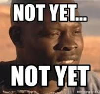

# SANS Holiday Hack Challenge 2024 WriteUp

This year's learning focus was on PowerShell scripting, as it is used extensively in blue teams.

Every single challenge was solved entirely using PowerShell, even graphical challenges.

> Comments and images are indented - these sections are not required to complete the challenges, but provide additional detail and/or explanations

Required actions like clicking or entering text or running PowerShell scripts are not indented

### Prologue

[01 - Holiday Hack Orientation](Act%200%20(Prologue)/01%20-%20Holiday%20Hack%20Orientation.md)

[02 - Elf Connect](Act%200%20(Prologue)/02%20-%20Elf%20Connect.md)

[03 - Elf Minder 9000](Act%200%20(Prologue)/03%20-%20Elf%20Minder%209000.md)

### Act I

[04 - Curling](Act%201/04%20-%20Curling.md)

[05 - Frosty Keypad](Act%201/05%20-%20Frosty%20Keypad.md)

[06 - Shreds.zip](Act%201/06%20-%20Shreds.zip.md)

[07 - Hardware Hacking 101 - Part 1](Act%201/07%20-%20Hardware%20Hacking%20101%20-%20Part%201.md)

[08 - Hardware Hacking 101 - Part 2](Act%201/08%20-%20Hardware%20Hacking%20101%20-%20Part%202.md)

### Act II

[09 - Mobile Analysis](Act%202/09%20-%20Mobile%20Analysis.md)

[10 - Snowball Showdown](Act%202/10%20-%20Snowball%20Showdown.md)

[11 - Microsoft KC7](Act%202/11%20-%20Microsoft%20KC7.md)

[12 - Drone Path](Act%202/12%20-%20Drone%20Path.md)

[13 - PowerShell](Act%202/13%20-%20PowerShell.md)

### Act III

